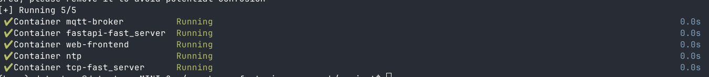

# On performing a test session - Apr 2, 2026

To perform a test run, here is the to-do list.

All operations listed here are assumed to be run on the Alienware PC (Cy's dev PC) unless otherwise stated.

1. Initialize the middleware: databroker and image analysis machine
2. Initialize the device nodes (IMU, cam, robot)
3. Ensure the dashboard shows "Listening status"
4. Start a session from the dashboard
5. Start the node processes
6. Start the robot
7. When the robot is finished, stop the node devices
8. Stop the session
9. Celebrate / Review Data

## 1 Initialize the middleware

The middleware (Data Broker) is running on the MiniPC 2 downstairs. This should already be active, as we do not ever shut it off. To check, visit the [Dashboard](http://192.168.1.76/data/dashboard). If that dashboard is not reachable, then continue. If it is reachable and displaying green lights, skip to step 2.

To initialize the middleware you must ssh into the machine and run a docker compose up command. This can be done anywhere on the network but, as stated, this is currently being executed on the Alienware PC in the upstairs lab.

Open a terminal session and execute the following:

```
ssh data-team@192.168.1.76
```

When prompted for a password:

```
1234
```

This puts you into the MiniPC 2 running the middleware.

Now move into the middleware's directory:

```
cd smart_manufacturing_research/project
```

From here you can start the docker containers:

```
docker compose up -d
```

Use the `-d` flag to run the command **detached** so the terminal does not follow the active docker processes. You should see something similar to this:



Finally, start the image analysis machine.

Open a new terminal and do the following:

```
ssh username@192.168.1.113
```

Password:

```
password
```

Change directory:

```
cd camera_sensor_fusion/pi-stream/
```

Run process:

```
docker compose up -d
```

Now we are done setting up the middleware. The [Dashboard](http://192.168.1.76/data/dashboard) should now be active.

## 2. Initialize the device nodes

The node devices (nodes) are Raspberry Pis that either have a camera or IMU attached. These should be physically powered on before continuing.

These are all attached to the network, so we simply ssh into them, change directory into the docker compose files, run the compose command, and we're done.

Currently there are 4 nodes: 2 cameras and 2 IMUs.

It is recommended that you have 4 terminal windows open. Each one ssh'ed into a node. Then have the `docker compose up` command ready in the terminal. When you are ready to start a session, execute the command in each terminal.

### IMUs

#### IMU on 192.168.1.83

```
ssh admin@192.168.1.83
```

Password:

```
password
```

Change directory into the container files:

```
cd smart-mfg-imu/
```

Run docker compose up, making sure to give the proper flags for this IMU. This IMU with the IP address ending in 83 is given the `--env-file env/imu-83.env` flag. Again `-d` is used for detached mode.

> Remember that once we run the docker compose up command, the process of acquiring data and sending it to the middleware starts. So do not run this command until you are ready to send data.

> Typically we will have 4 terminals open with everything done except the docker compose command, then once we are ready we execute them.

```
docker compose --env-file env/imu-83.env up -d
```

#### IMU on 192.168.1.84

The process is exactly the same except for the env flag we give, as this node is on an IP ending in 84.

```
ssh admin@192.168.1.84

password

cd smart-mfg-imu/ 

docker compose --env-file env/imu-84.env up -d
```

---

### Cameras

#### Camera on 192.168.1.80

```
ssh admin@192.168.1.80
```

Password:

```
admin
```

Change directory into the container files:

```
cd camera_sensor_fusion/
```

Start process:

```
docker compose up -d
```

#### Camera on 192.168.1.92

```
ssh admin@192.168.1.92
```

Password:

```
admin
```

Change directory into the container files:

```
cd camera_sensor_fusion/middleware/
```

Start process:

```
docker compose up -d
```

---

### Robot

The robot is a special case and must be started manually by a human operator in the downstairs lab. Ask Dr. Arbuckle.

## 3. Ensure dashboard shows "Listening status"

The dashboard should display green lights below every message box. The green lights indicate that the middleware is **listening** for incoming data.

If the lights are green then a session is ready to be started.

If there are any red messages in the message boxes you can ignore them. They likely say something similar to:

```
[2026-04-02 11:08:26 AM CDT] CAMERA batch insert failed: No current active session. Run a GET to start a new session."
```

These are safe to ignore.

## 4. Start a session from the dashboard

When the terminals are open and the docker compose up commands are ready, the lights on the dashboard are green, and a human operator is ready on the robot, you are ready to start a session from the dashboard.

Simply click the **"Start Session"** button on the dashboard to start a new session.

## 5. Start the node processes

Now you must execute the docker compose up commands on each of the terminal sessions. This will start their data collection and sending processes.

It is now recommended that for each terminal connected to a node you prepare, but do not execute, this command:

```
docker compose down
```

This will be useful when you want to end a session.

## 6. Start the robot

Just after you start the nodes, the human operator should start the robot operations.

## 7. When the robot is finished, stop the node devices

When the human operator gives the signal that the robot is finished with its operations, execute the compose down commands on each of the terminal sessions to stop the data collection and sending processes.

```
docker compose down
```

## 8. Stop session

Once the robot and all nodes are stopped, wait maybe 20 seconds. This will allow all data to (without a doubt) be sent to the middleware.

Then click the **"Stop Session"** button on the dashboard.

This will stop the session and complete the test.

## 9. Celebrate / Review Data

Feel free to [explore the data](http://192.168.1.111:8080/browser/) and celebrate a successful test. 

